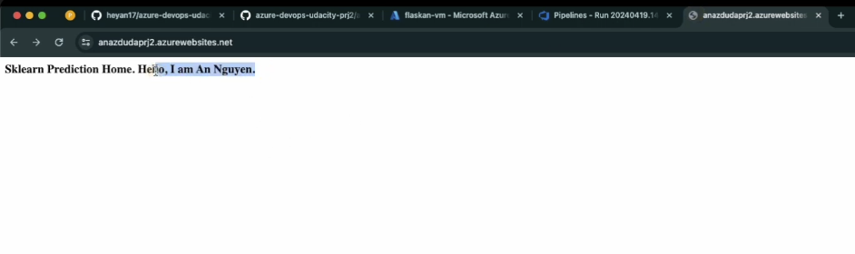
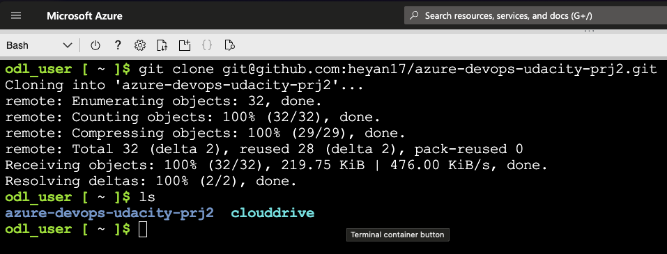
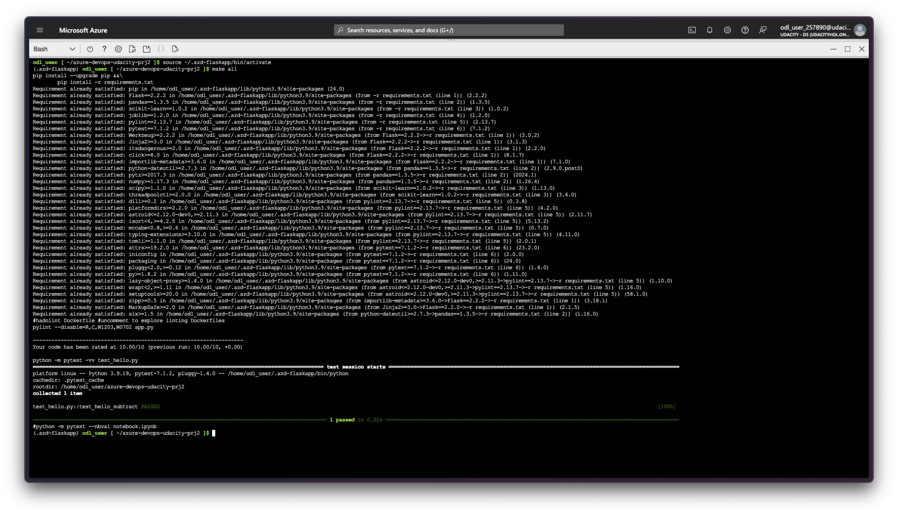
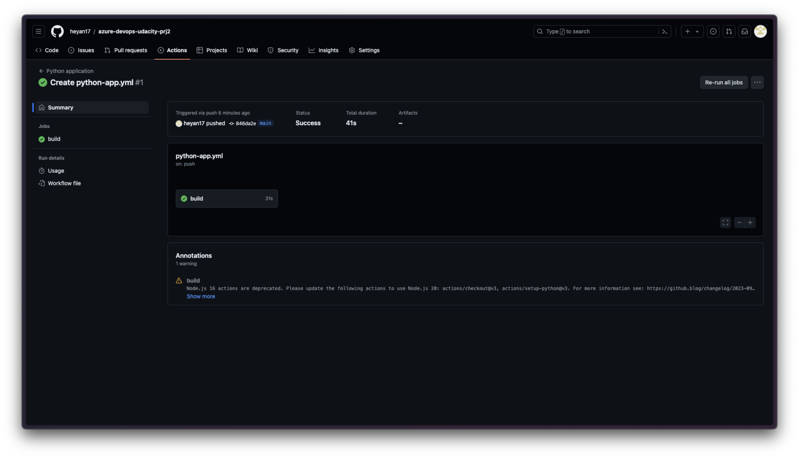
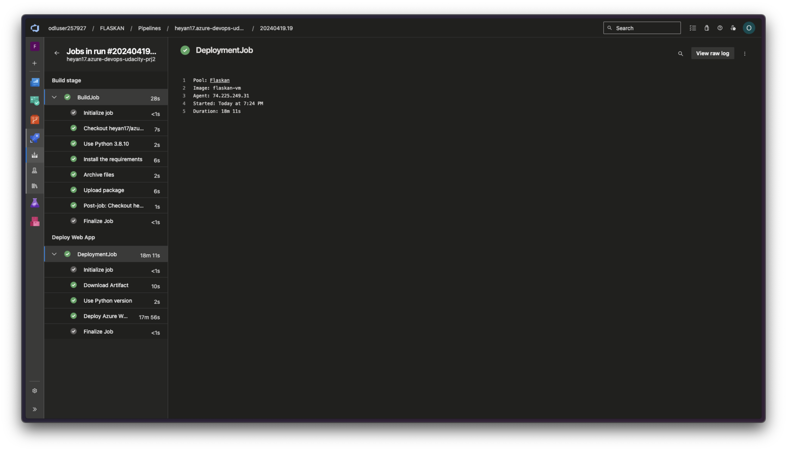
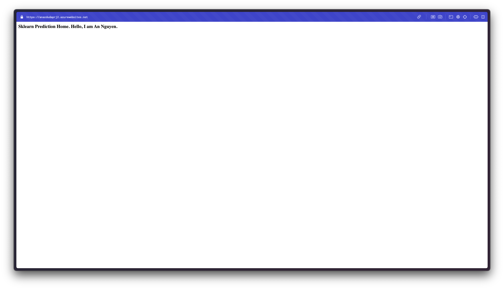
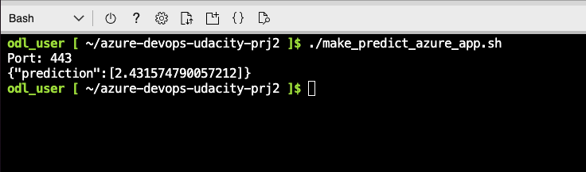
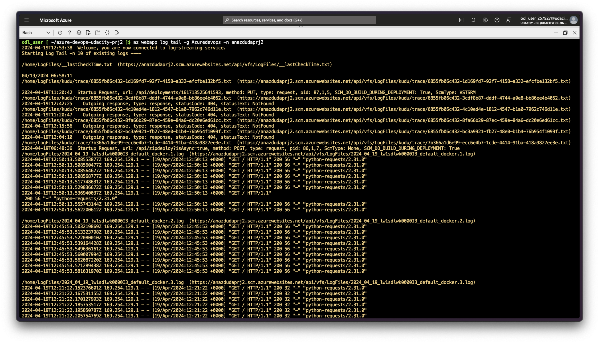
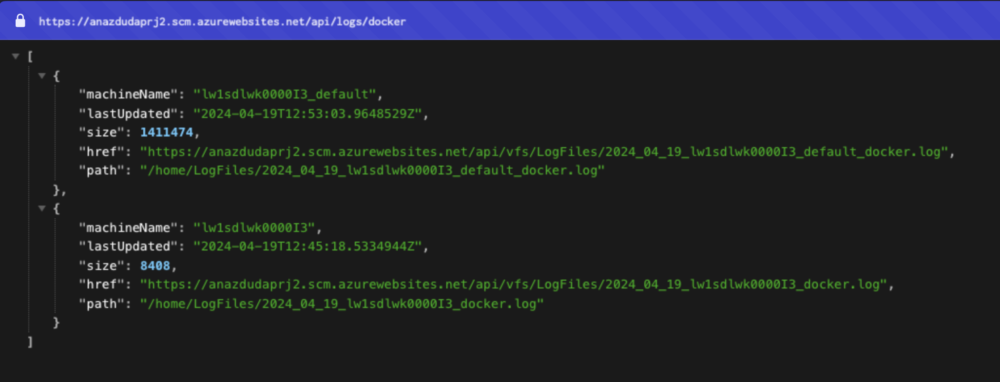

# Overview

This project is an sample of CI/CD using Azure DevOps. This repo will enable you to:
- Deploy an application in Azure Cloud Shell
- Deploy an application as an Azure App Service
- Load testing

## Project Plan

* Trello board for the project: [Trello link](https://trello.com/b/4pBYlosv/azure-cloud-project-2)
* Spreadsheet project plan: [GoogleSheet link](https://docs.google.com/spreadsheets/d/1KYGz4-JPhHJg1KEsSaAOcNnVr4G41t1C/edit?usp=sharing&ouid=104543931335870760692&rtpof=true&sd=true)

## Instructions

* Architectural Diagram

* Project running on Azure App Service
abc

* Project cloned into Azure Cloud Shell

* Passing tests that are displayed after running the `make all` command from the `Makefile` including output of the test run

** Passing GitHub Action build

* Successful deploy of the project in Azure Pipelines.

* Running Azure App Service from Azure Pipelines automatic deployment

* Successful prediction from deployed flask app in Azure Cloud Shell. 

* Output of streamed log files from deployed application

`https://anazdudaprj2.scm.azurewebsites.net/api/logs/docker`

## Enhancements

- There should be branch for development environment and testing environment separately.
- There should be an mantenance page UI befor production deployment.

## Demo 

Youtube video: https://youtu.be/oBWjMsrTvx0

